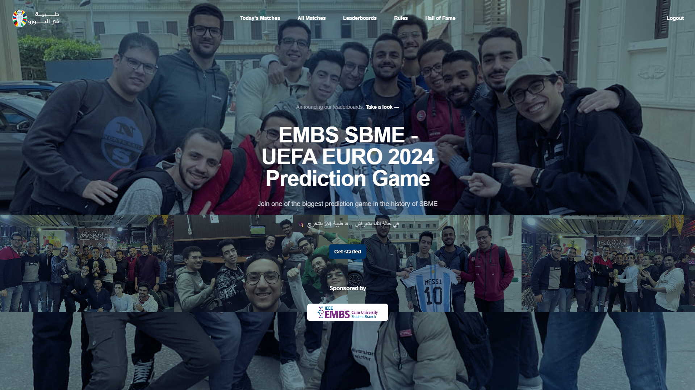
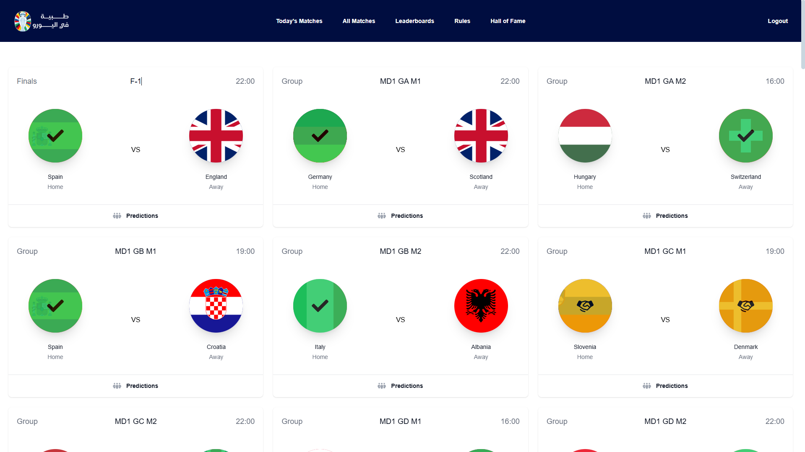
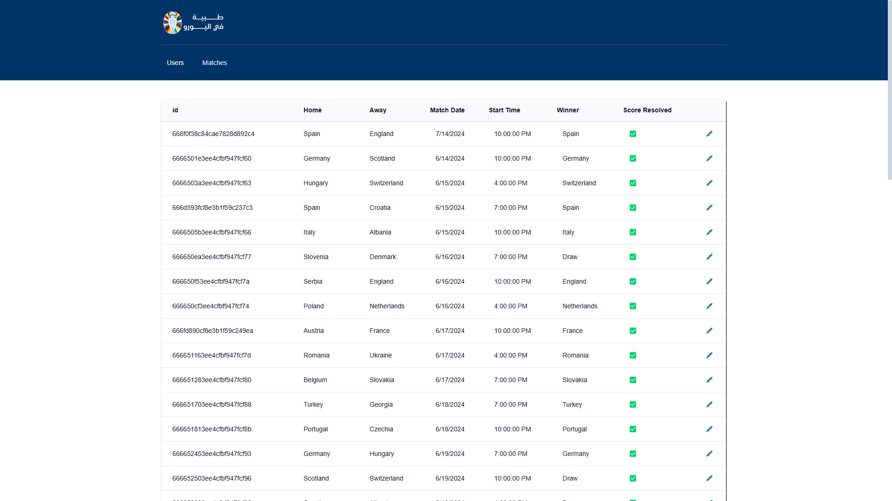
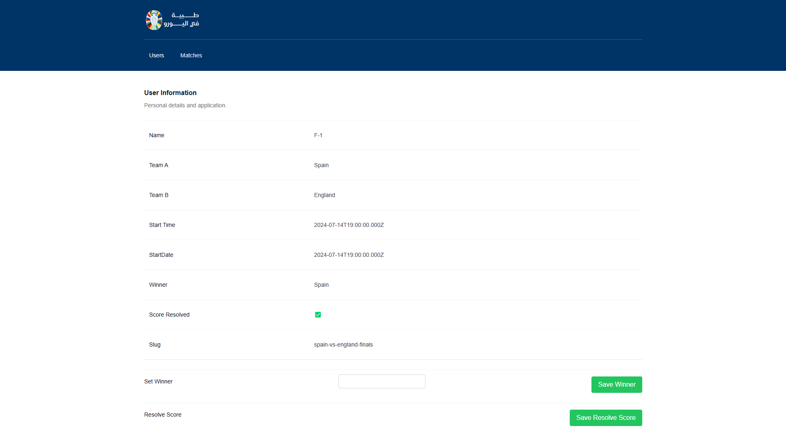

# SBME AFCON/SBME Prediction Game

### Table of Contents

- [Introduction](#introduction)
- [Features](#features)
- [System Architecture](#system-architecture)
- [Technologies](#technologies)
- [How to Run the Project](#how-to-run-the-project)
- [Screenshots](#screenshots)
- [Documentations](#documentations)

### Introduction

This platform was developed at first to automate the process of predicting the match scores of football
tournaments, after the success of SBME 2024 World cup game on whatsapp. I needed a new approach to be able
to manage the game effectively and here came this system which helps you organize such idea and extend it beyond it.

the system was firstly operated at the African Cup of Nations 2024 (v1) and then at the EURO 2024 (v2).

v1 - AFCON version [afcon] is available on (https://afcon-sbme-game.vercel.app)

v2 - EURO version [master & euro] is available on (https://euro-sbme.vercel.app)

### Features

- [x] Authentication & Authorization
    - User & Admin Roles
    - Login
    - Register
    - Forgot Password
    - Reset Password
- [x] Matches
    - Create Matches
    - Update Matches
    - Delete Matches
- [x] Predict match winner
- [x] Leaderboard for tracking users' scores
- [x] Admin has full control on the system
- [x] Easy and user-friendly interface

### Technologies

#### Frontend

<div>


</div>

#### Backend

<div>


</div>

#### Database

Multiple databases are used in the system. Each service has its own database, according to its needs.
<div>


</div>

#### Deployment 

<div>


</div>

### How to Run the Project

You can run the project locally by following these steps:

1. Clone the project
2. Install the dependencies for backend and frontend
   ```bash
   cd [client] or [server]
   npm install
   ```
3. Run the backend and frontend

```bash
   cd [client] or [server]
   npm run dev
   ```

4.Enjoy!

### Screenshots
#### User pages




#### Admin pages



### Documentations
API Documentation is available at [Postman](https://documenter.getpostman.com/view/21802740/2sAXqnePeY)


### How to contribute

1. Fork the project
2. Create a new branch (`git checkout -b improve-feature`)
3. Make the appropriate changes in the files
4. Add changes to reflect the changes made
5. Commit your changes (`git commit -am 'Improve feature'`)
6. Push to the branch (`git push origin improve-feature`)
7. Create a Pull Request
8. I will review it and merge it if it is accepted
9. Enjoy!


#### Created and maintained by [Ibrahim Mohamed - SBME 2024](https://github.com/1brahimmohamed)
